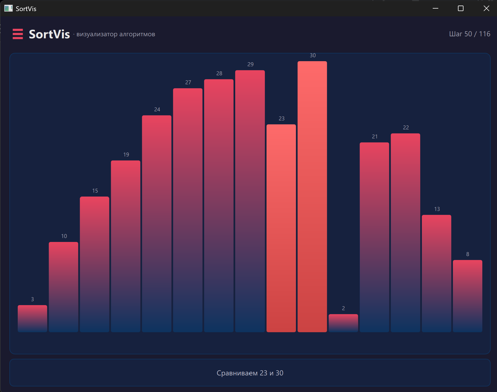
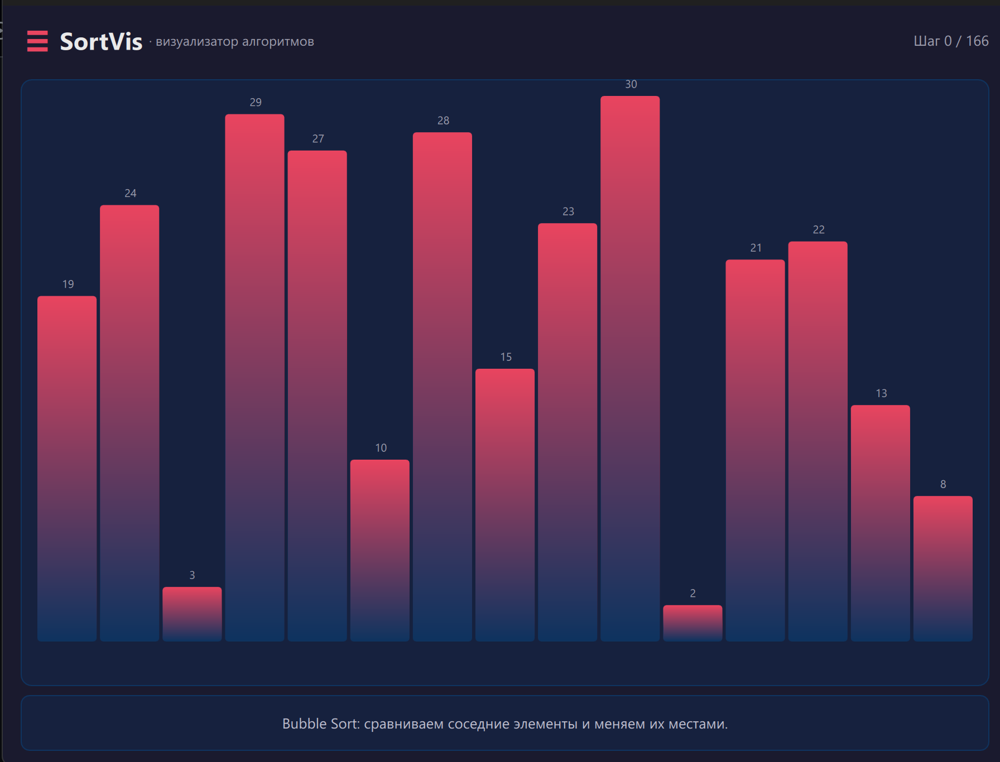
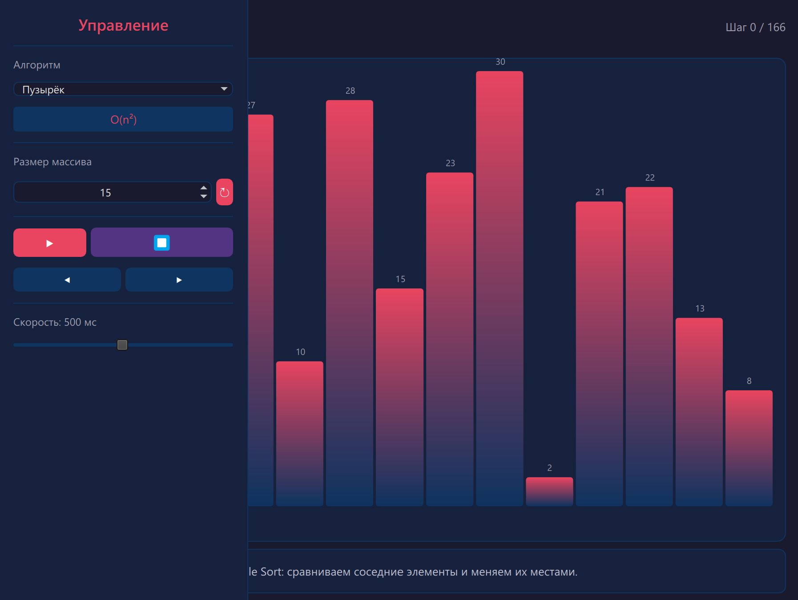

# SortVis — визуализатор алгоритмов сортировки



Наглядное desktop-приложение для изучения и демонстрации работы алгоритмов сортировки. Позволяет пошагово наблюдать за процессом упорядочивания массива, сравнивать эффективность разных алгоритмов и отслеживать ключевые метрики.

---

## Возможности

### Управление массивом
- Генерация числового массива с настраиваемым размером (от 5 до 30 элементов)
- Автоматическая визуализация в виде столбчатой диаграммы

### Управление сортировкой
- **3 алгоритма:** пузырьковая, быстрая, сортировка слиянием
- Запуск, пауза и остановка выполнения
- Пошаговый режим (вперёд и назад)
- Регулировка скорости анимации (от 10 до 1000 мс)

### Информационная поддержка
- Отображение временной сложности (O-нотация) для каждого алгоритма
- Подсчёт текущего шага и общего количества шагов
- Цветовая подсветка сравниваемых, переставляемых и опорных элементов
- Текстовое описание выполняемой операции на каждом шаге

### Интерфейс
- Тёмная тема
- Выезжающая панель управления
- Отображение количества пройденых и оставшихся шагов

---

## Алгоритмы

| Алгоритм | Сложность | Описание |
|----------|-----------|----------|
| Пузырёк (Bubble Sort) | O(n²) | Сравниваем соседние элементы и меняем их местами |
| Быстрая (Quick Sort) | O(n log n) | Выбираем опорный элемент и разделяем массив |
| Слияние (Merge Sort) | O(n log n) | Делим массив на части и объединяем их обратно |

---

### Структура проекта

```
├── qml/
│   └── Main.qml              # Пользовательский интерфейс
├── src/
│   ├── ArrayModel.h/cpp      # Модель данных массива
│   ├── BubbleSort.h/cpp      # Пузырьковая сортировка
│   ├── QuickSort.h/cpp       # Быстрая сортировка
│   ├── MergeSort.h/cpp       # Сортировка слиянием
│   ├── SortingController.h/cpp # Контроллер сортировки
│   ├── SortingStrategy.h     # Интерфейс стратегии сортировки
│   └── main.cpp              # Точка входа
├── docs/
│   ├── SRS.pdf               # Спецификация требований
│   └── screenshots/          # Скриншоты приложения
├── tests/                    # Модульные тесты (Catch2)
├── CMakeLists.txt
└── README.md
```

---

## Скриншоты




---

## Установка и запуск

### Требования
- Qt 6.8+
- CMake 3.16+
- Компилятор с поддержкой C++17

### Сборка из исходников

```bash
git clone https://github.com/твой-юзернейм/твой-репозиторий.git
cd sorting
mkdir build && cd build
cmake ..
cmake --build .
```

### Запуск

```bash
./appsort_visualizer
```
---
## Документация
[Спецификация требований (SRS)](docs/SRS.pdf) — полное описание функциональных и нефункциональных требований, UML-диаграммы.

